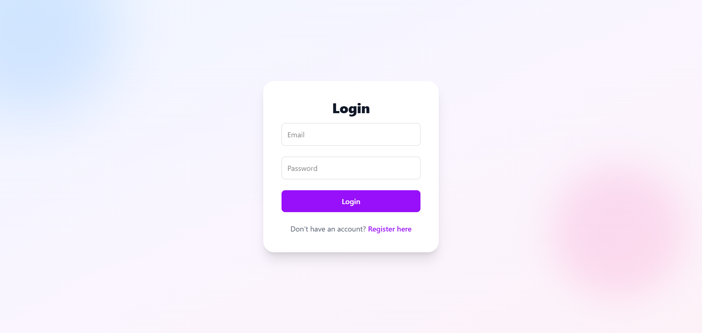
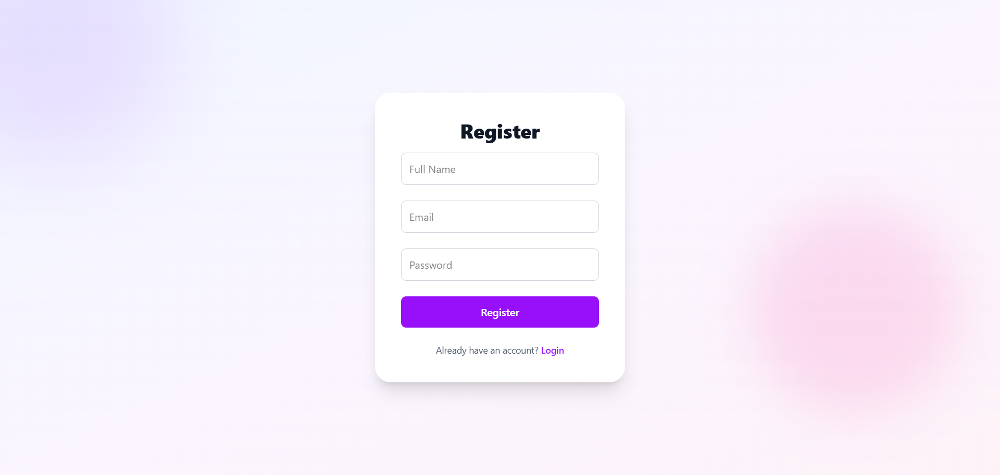
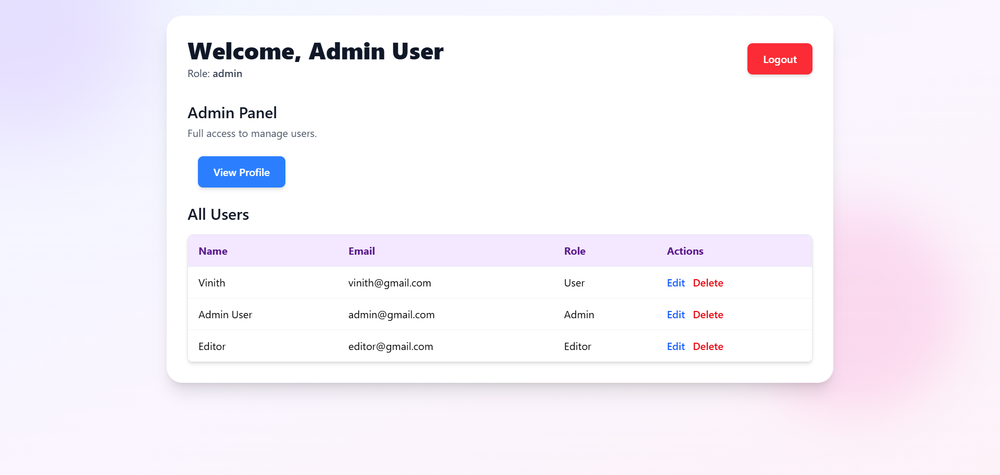
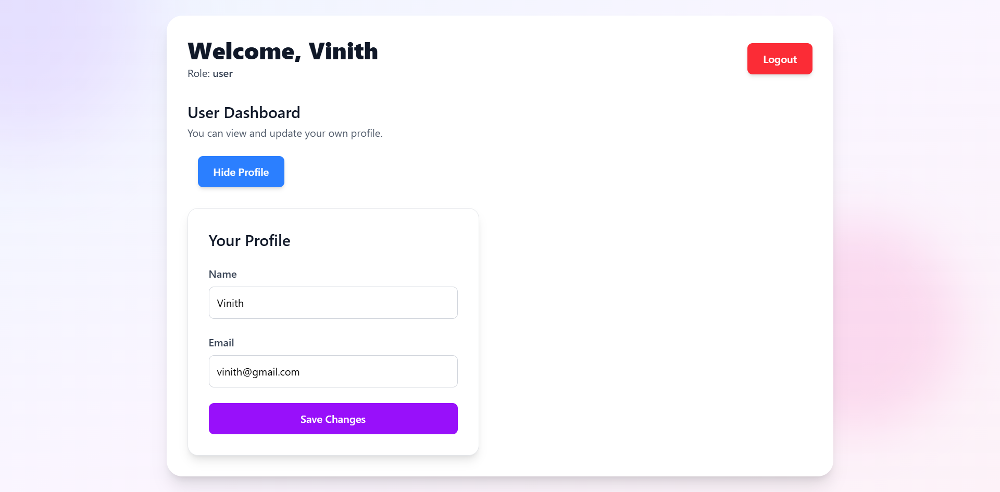
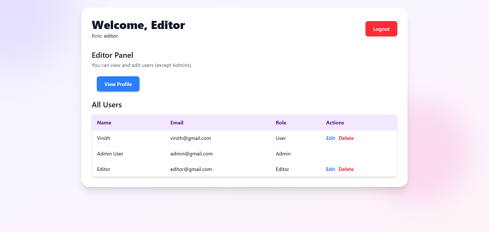

# 🔐 AccessForge

AccessForge is a MERN stack-based User Access Management System featuring secure **JWT authentication**, **role-based access control (RBAC)**, and an interactive **admin dashboard**. It allows efficient management of users, roles, and permissions in modern web applications.

---

## ⚡ Features

- ✅ JWT-based Authentication
- 🔒 Role-Based Access Control (RBAC): Admin, Editor, User
- 👤 Full User Management (CRUD)
- 🧑‍💼 Admin Dashboard for Role Assignments
- 🌐 RESTful API using Express & MongoDB
- ⚛️ Protected React (Vite) Frontend with Auth Context
- 💾 Modular & Scalable Codebase

---

## 🛠 Tech Stack

| Layer       | Tech                         |
|------------|------------------------------|
| Frontend    | React (Vite), TailwindCSS    |
| Backend     | Node.js, Express.js          |
| Database    | MongoDB (Mongoose)           |
| Auth        | JSON Web Tokens (JWT)        |

---

## 📁 Folder Structure

```

AccessForge
│
├── client/               # React + Vite frontend
│   └── src/
│       ├── api/          # Axios config
│       ├── components/   # UI + Modals
│       ├── context/      # AuthContext
│       └── pages/        # Login, Register, Dashboard
│
└── server/               # Node.js backend
    ├── config/           # MongoDB connection
    ├── controllers/      # Logic for auth & user
    ├── middleware/       # Auth & role checks
    ├── models/           # User & Role schemas
    ├── routes/           # API routes
    └── utils/            # JWT generation

````

---

## 🚀 Getting Started

### 1. Clone the Repo

```bash
git clone https://github.com/yourusername/AccessForge.git
cd AccessForge
````

---

### 2. Backend Setup

```bash
cd server
npm install
cp .env.example .env    # Add your DB URI and JWT_SECRET
npm run dev
```

#### `.env` Example:

```env
MONGO_URI=mongodb+srv://your_mongo_uri
JWT_SECRET=your_secret_key
PORT=5000
```

---

### 3. Frontend Setup

```bash
cd client
npm install
npm run dev
```

---

## 🔌 API Overview

### 🔐 Auth Routes (`/api/auth`)

| Route     | Method | Description            |
| --------- | ------ | ---------------------- |
| /register | POST   | Register new user      |
| /login    | POST   | Authenticate & get JWT |

### 👤 User Routes (`/api/users`)

| Route | Method | Access Level  |
| ----- | ------ | ------------- |
| /     | GET    | Admin, Editor |
| /\:id | GET    | Authenticated |
| /\:id | PUT    | Admin, Editor |
| /me   | PUT    | Authenticated |

---

## 🧠 RBAC (Roles & Access)

* **Admin**: Full access to all users & role management
* **Editor**: Can manage users (read/edit)
* **User**: Can manage only their own profile

Middleware ensures protected routes:

```js
// Example
router.get("/", authMiddleware, roleMiddleware(["admin", "editor"]), getAllUsers);
```

---

## 🔄 Auth Flow

1. User registers or logs in
2. Backend generates JWT with `userId`
3. Token is stored in localStorage
4. React Context manages auth state
5. Protected routes block unauthorized access

---

## 🖼️ Screenshots

### 1. 🔐 Login Page


### 2. 🔐 Register Page


### 3. 📋 Admin Dashboard


### 4. 🧑‍💼 User Dashboard


### 5. 🧑‍💼 Editor Dashboard


---

## 👨‍💻 Author

Developed by **VinithBylapudi** **https://github.com/Vinith1801/AccessForge.git**

---
